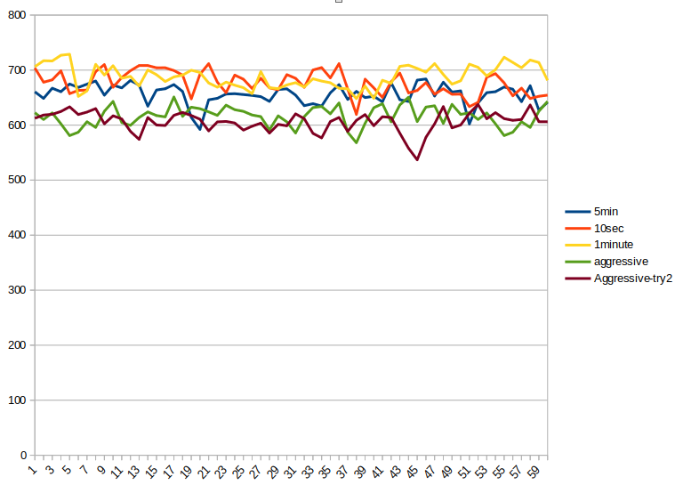

Домашнее задание

Настройка autovacuum с учетом оптимальной производительности
Цель:

- запустить нагрузочный тест pgbench
- настроить параметры autovacuum для достижения максимального уровня устойчивой производительности

-     создать GCE инстанс типа e2-medium и standard disk 10GB
-    установить на него PostgreSQL 13 с дефолтными настройками
-    применить параметры настройки PostgreSQL из прикрепленного к материалам занятия файла

параметры:

>     max_connections = 40
>     shared_buffers = 1GB
>     effective_cache_size = 3GB
>     maintenance_work_mem = 512MB
>     checkpoint_completion_target = 0.9
>     wal_buffers = 16MB
>     default_statistics_target = 500
>     random_page_cost = 4
>     effective_io_concurrency = 2
>     work_mem = 6553kB
>     min_wal_size = 4GB
>     max_wal_size = 16GB

Проверяем какие конфиги включаются в главный конфиг-файл:

>     postgres@heaven:~$ grep include /etc/postgresql/13/main/postgresql.conf 
>     include_dir = 'conf.d'                  # include files ending in '.conf' from

добавляем в каталог include_dir файл с именем например:
   

> /etc/postgresql/13/main/conf.d/01-pgbench.conf

если сделать так, то создавая файлы типа 02-name.conf можно именовать изменения, и сделать так, чтобы нумерация сделала так, что более позднее изменение переприменяло предыдущие.

рестарт экземпляра. 

-   зайти под пользователем postgres - sudo su postgres
-  выполнить pgbench -i postgres

>     postgres@pg-06:~$ pgbench -i postgres 
>     dropping old tables...
>     NOTICE:  table "pgbench_accounts" does not exist, skipping
>     NOTICE:  table "pgbench_branches" does not exist, skipping
>     NOTICE:  table "pgbench_history" does not exist, skipping
>     NOTICE:  table "pgbench_tellers" does not exist, skipping
>     creating tables...
>     generating data (client-side)...
>     100000 of 100000 tuples (100%) done (elapsed 0.09 s, remaining 0.00 s)
>     vacuuming...
>     creating primary keys...
>     done in 0.55 s (drop tables 0.00 s, create tables 0.02 s, client-side generate 0.32 s, vacuum 0.10 s, primary keys 0.11 s).

- запустить pgbench -c8 -P 10 -T 600 -U postgres postgres

>     transaction type: <builtin: TPC-B (sort of)>
>     scaling factor: 1
>     query mode: simple
>     number of clients: 8
>     number of threads: 1
>     duration: 600 s
>     number of transactions actually processed: 156308
>     latency average = 30.707 ms
>     latency stddev = 32.359 ms
>     tps = 260.486745 (including connections establishing)
>     tps = 260.488548 (excluding connections establishing)

-    дать отработать до конца
-    дальше настроить autovacuum максимально эффективно
-    построить график по получившимся значениям
-    так чтобы получить максимально ровное значение tps

я попытался использовать дефолтные настройки (желтая линия на графике, 1минутный интервал запуска)
а изменял у частоту вызова автовакуума до высокого (оранжевая линия): 
autovacuum_naptime = 10s
и другое крайнее значение как 5 минут (это половина 10 минутного интервала - синяя  линия, я должен 1-2 раза испытать влияние вакуума и увидеть его влияние).
А также рекомендованные агрессивные настройки. 

Во всех случаях по максимальной скорости транзакций я упираюсь в производительность дисковой системы. 
Cама скорость транзакций сначала эксперимента как-то зависела от настроек. Но в процессе двух итераций  у меня на некоторое время, порядка 20 минут просела скорость, я полагаю что это влияние "шумных соседей" по виртуалке. Поэтому такой эксперимент считаю сильно зависимый от внешних обстоятельств.

[данные](https://docs.google.com/spreadsheets/d/19agutkvP_GkjNuXj_THuZ54dyCOwDHr7o471pewgUkk/edit?usp=sharing)

Вывод:
частота вызова несколько нивелирует неравномерность скорости проведения транзакций.  
подняв частоту до 10 сек, я получил самый низкий разброс результатов на 10секундном интервале (см. ячейку с3 - stdev для 10s).
Но увеличив аггресивносить анализатора я начал получать более низкий перфоманс, чем даже на "стандартных настройках". Или на стандартных настройках при 
Считаю необходимым повторить эксперимент на on-premise оборудовании, с предсказуемой производительностью виртуалки и оборудования. 

Критерии оценки:

Выполнение ДЗ: 10 баллов

    2 балл за красивое решение

    2 балл за рабочее решение, и недостатки указанные преподавателем не устранены

Рекомендуем сдать до: 24.10.2021

