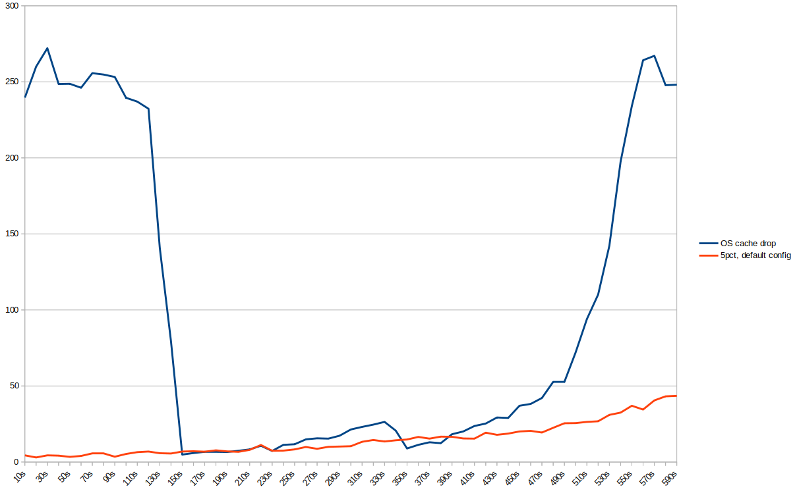
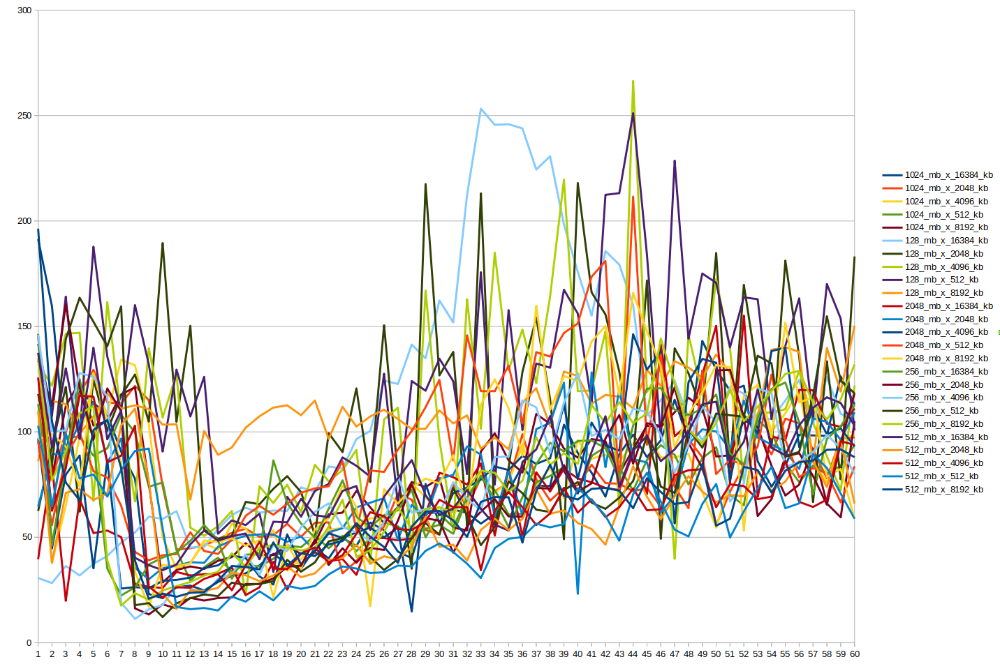
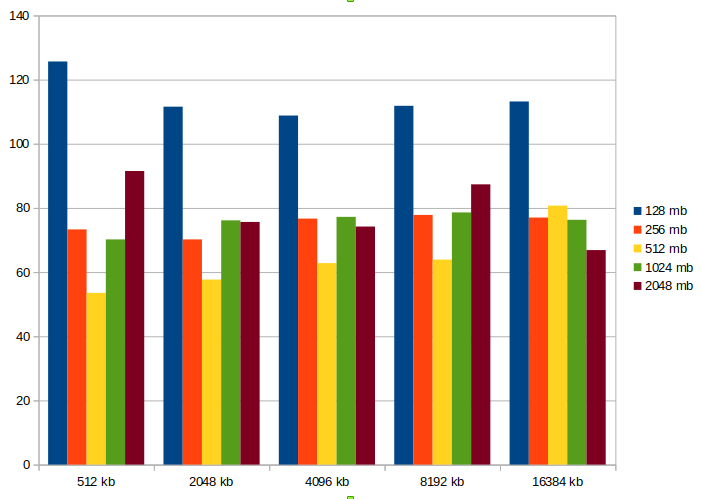

Домашнее задание

Нагрузочное тестирование и тюнинг PostgreSQL
Цель:

    сделать нагрузочное тестирование PostgreSQL
    настроить параметры PostgreSQL для достижения максимальной производительности

• сделать проект ---10
• сделать инстанс Google Cloud Engine типа e2-medium с ОС Ubuntu 20.04
• поставить на него PostgreSQL 13 из пакетов собираемых postgres.org
• настроить кластер PostgreSQL 13 на максимальную производительность не
обращая внимание на возможные проблемы с надежностью в случае
аварийной перезагрузки виртуальной машины
• нагрузить кластер через утилиту

https://github.com/Percona-Lab/sysbench-tpcc (требует установки
https://github.com/akopytov/sysbench)

./tpcc.lua --pgsql-host=10.164.0.7  --pgsql-port=5432   --pgsql-user=sysbench --pgsql-password='sysbench' --pgsql-db='sysbench' --time=300 --threads=4 --report-interval=10 --tables=16 --scale=1 --db-driver=pgsql prepare

Оценил что есть параметры --tables= --scale=, они управляют кол-вом данных. размером одной таблицы и кол-вом таблиц. 1 юнит (1 таблица на 1 scale) это примерно 120мб. Из этого можно выбрать размер базы. Я сделал --tables=16 --scale=1, но только потому что этот шаг у меня занял очень много времени и не было желания переделывать. 

Заметил следующие аномалии которые влияют на время выполнения:
при увеличении количества потоков - множество дедлоков. 
в каком-то смысле это нивелируется опцией --trx_level=RC которая понижает уровень изоляции для обновляющих операций (правда это приводит к некоторым последствиям в данных.)

Т.к. тестирование соединяется исключительно по tcp, создал отдельную машину, из которой буду запускать тесты. 

##### Влияние кеширования операционной системой

Влияние кеширования операционной системой- очень сильное. скорость транзакций выросла от 5.6тпс до 250 при дефолтных настройках.
это настолько много, что собственно настройки сервера нивелируются.
Можно сбросить кеши операционной системы командой
echo 1 > /proc/sys/vm/drop_caches

Еще хорошей стратегией будет сгенерировать данных в базе было настолько много, чтобы кеширование операционной системы не было способно держать существенную часть данных в оперативной памяти, чтобы данные постоянно вытеснялись на диск.
Однако это нужно хотябы данных хотя бы в 2-4 раза больше объема оперативной памяти, это 8-16гб, однако подготовка среды тестирование у меня занимает очень много времени.

Есть опция 
https://www.kernel.org/doc/Documentation/sysctl/vm.txt ( vfs_cache_pressure ) - This percentage value controls the tendency of the kernel to reclaim the memory which is used for caching of directory and inode objects.
выставил его в 5%
sysctl -w  vm.vfs_cache_pressure=5 >> /etc/sysctl.conf

но судя по графику наполенение кеша всеравно происходит, просто медленнее. 
Но они потом накачаются снова, и снова прогретый кеш операционки будет выигрывать любые настройки постгрес-сервера, по сравнению с холодным но сконфигурированным.
так что вернул кеширование операционной системы в состояние по-умолчанию.
получил результаты:

##### pgtune
Использовал pgtune. Для моей ситуации (13 версия, 4 гб оперативной памяти, OLTP, хдд, максмальное кол-во клиентов 20 , при тестировании в 16 потоков) я получил и применил рекомендации:

>     max_connections = 20
>     shared_buffers = 1GB
>     effective_cache_size = 3GB
>     maintenance_work_mem = 256MB
>     checkpoint_completion_target = 0.9
>     wal_buffers = 16MB
>     default_statistics_target = 100
>     random_page_cost = 4
>     effective_io_concurrency = 2
>     work_mem = 52428kB
>     min_wal_size = 64MB
>     max_wal_size = 1GB
>     max_worker_processes = 2
>     max_parallel_workers_per_gather = 1
>     max_parallel_workers = 2
>     max_parallel_maintenance_workers = 1

Я указал весьма низкое значение max_connections, pgtune предложил для OLTP-характера нагрузки очень высокое work_mem.
Провёл тесты на этом конфиге, получил катастрофически низкий результат. "не более 16 tps".

Предположл что параметры shared_buffers и work_mem влияют на производительность при тестировании.  которые меняют  shared_buffers и work_mem в разнхы диапазонах и составляют результаы. 
Эти тесты заняли 6 часов.

Среднее время в зависимости от параметров.

• написать какого значения tps удалось достичь, показать какие параметры в
какие значения устанавливали и почему.

Наилучшие результаты (108-125 tps ) получил при 
>     max_connections = 20
>     shared_buffers = 128MB
>     effective_cache_size = 3GB
>     maintenance_work_mem = 256MB
>     checkpoint_completion_target = 0.9
>     wal_buffers = 16MB
>     default_statistics_target = 100
>     random_page_cost = 4
>     effective_io_concurrency = 2
>     work_mem = 512kB
>     min_wal_size = 64MB
>     max_wal_size = 1GB
>     max_worker_processes = 2
>     max_parallel_workers_per_gather = 1
>     max_parallel_workers = 2
>     max_parallel_maintenance_workers = 1

При, shared_buffers  = 128мб, и различных work_mem от 512кб до 16мб, но наивысшие показатели при самых минимальных значениях.  Это совершенно противоречит идее "чем больше памяти дадим для shared_buffers и work_mem тем лучше". Полагаю что условия тестирования какие-то некорректные, например влияение кеширования операционной системой и малый объем данных. А также на графиках есть "падение производительности" на второй-третей минуте практически у всех серий тестировая.
